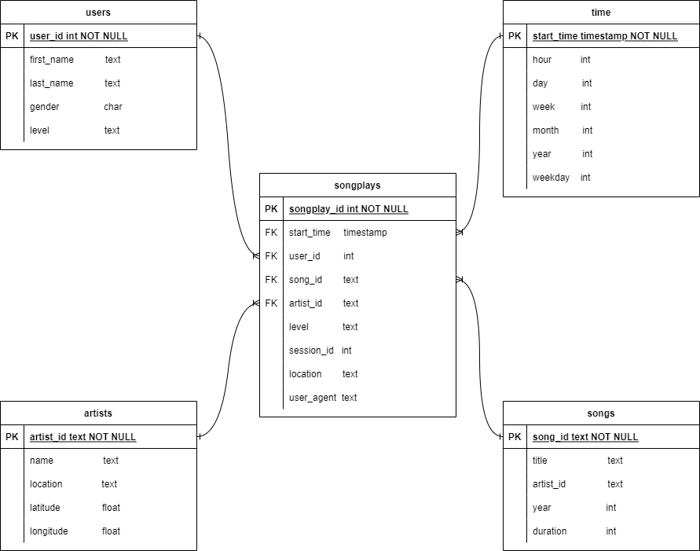

# Project 1 - Data Modeling with Postgres

A startup called Sparkify hired you as a Data Engineer to help their Analytics team to get useful insights from their music streaming app. By this time, all the information is stored in two datasets consisting of JSON files and the data analysts have no easy way to query their data.

Your mission is to collect the data, model it as a star schema to optimize queries on a songplay and load it in a Postgres database.

This project is part of the **Udacity Data Engineer nanodegree program** as a first assignment related to Data Modeling with Postgres course.

----

## Data Engineering Tasks

The main goal is to extract, transform and load data from two datasets:

1. Song Dataset: A folder containing a data subset of the [Million Song Dataset](https://labrosa.ee.columbia.edu/millionsong/). It consists of JSON files partitioned in 3-level subfolders with the first 3 letters of the songs' track ID.
1. Log Dataset: Simulated log event data from the streaming app. It consists of JSON files partitioned by month and year when a streaming song was played.

To achieve this, it is proposed the following tasks:

### Create Statements

1. Write `CREATE` statements in `sql_queries.py` to create each table.
1. Write `DROP` statements in `sql_queries.py` to drop each table if it exists.
1. Run `create_tables.py` to create your database and tables.
1. Run `test.ipynb` to confirm the creation of your tables with the correct columns. Make sure to click "Restart kernel" to close the connection to the database after running this notebook.

### Build ETL Processes

Follow instructions in the `etl.ipynb` notebook to develop ETL processes for each table. At the end of each table section, or at the end of the notebook, run test.ipynb to confirm that records were successfully inserted into each table. Remember to rerun create_tables.py to reset your tables before each time you run this notebook.

### Build ETL Pipeline
Use what you've completed in `etl.ipynb` to complete `etl.py`, where you'll process the entire datasets. Remember to run `create_tables.py` before running `etl.py` to reset your tables. Run `test.ipynb` to confirm your records were successfully inserted into each table.

----

## Running Instructions

The achieve the goals described above, you should:

1. Create/Recreate tables by running in a shell terminal:
> python create_tables.py
2. Extract, Transform and Load data from JSON datasets to postgres database by running in a shell terminal:
> python etl.py

The two steps above are enough to load data for the Analysis Team. Additionally it has been provisioned some sample questions and queries that were written in `test.ipynb`.

----

## Data Model and Relationship

In this project, it is built a Postgresql database "sparkifydb" defined by a star schema with a unique fact table - "songplays" - and four possible dimensions - users, time, artists, and songs. The physical ERD is depicted below:

### Sample Analytics Questions

The songplays fact table has measurements for level (user subscription), session_id, location, user_agent (device or software) that we can aggregate and check through the 4 given dimensions.

With this model, we can answer some interesting questions like:
1. Which song has been most-streamed?
    
    - Answer: Unfortunately the data contains only a subset of the real data and there is only 1 song in the log JSON files that were played once.

    |artist_id | name | location | latitude | longitude | song_id | title | artist_id_1 | year | duration | count |
    |----|----|----|----|----|----|----|----|----|----|----|
    |AR5KOSW1187FB35FF4 | Elena | Dubai UAE | 49.80388 | 15.47491 | SOZCTXZ12AB0182364 | Setanta matins | AR5KOSW1187FB35FF4 | 0 | 269.58322 | 1 |

2. What is the average time of a user session?
    
    - Answer: As there is not enough information to get the duration of each session, I will group by session_id and compute the difference from the last and first start_time. Then an estimated average time spent in session could be given by:
    
    | avg_duration (s) |
    |----|
    | 3136.84959349594 |
    
3. Give a top 5 locations where the streaming app is most used.

    - Answer: This is a straight query associating a location with the songplays count. The results are below:
    
    | location | songplays_count |
    |----|----|
    |San Francisco-Oakland-Hayward, CA | 691 |
    | Portland-South Portland, ME | 665 |
    | Lansing-East Lansing, MI |557 |
    | Chicago-Naperville-Elgin, IL-IN-WI | 475 |
    | Atlanta-Sandy Springs-Roswell, GA | 456 |

4. Which day of the week do users listen the most?

    - Answer: Another direct query to count songplays based on weekdays. Surprisingly in this simulated data, people listen less to music on non-working days (Saturday and Sunday)
    
    | weekday | songplays_count |
    |----|----|
    |Wednesday|1364|
    |Friday|1295|
    |Tuesday|1071|
    |Thursday|1063|
    |Monday|1014|
    |Saturday|628|
    |Sunday|396|

5. Which hour of the day is most popular to listen?

    - Answer: Similar to previous one, but grouping by hour.
    
    |hour|songplays_count|
    |----|----|
    |16|542|
    |18|498|
    |17|494|
    |15|477|
    |14|432|
    |19|367|
    |20|360|
    |11|336|
    |13|324|
    |10|312|
    |12|308|
    |21|290|
    |9|270|
    |22|218|
    |8|207|
    |23|201|
    |6|183|
    |7|179|
    |5|162|
    |0|155|
    |1|15|
    |4|13|
    |2|11|
    |3|10|
   
6. Count the number of users in each user subscription level.

    - Answer: Simple question with the following result:
    
    | level | user_count |
    |----|----|
    |free|82 |
    |paid|22 |

**Note:** The SQL queries to answer above Analytic questions are written into the test.ipynb notebook.
